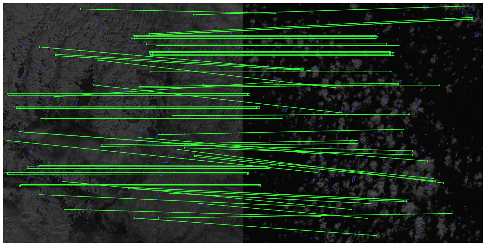

# Feature Matching in Satellite Images using Kornia and PyTorch

This project demonstrates a feature matching solution between large images (such as satellite images) using **Kornia**, a PyTorch-based computer vision library. It utilizes image splitting, keypoint detection, and matching techniques to handle large images efficiently and visualize matched keypoints between them.

## Solution Overview

The project uses Kornia to perform feature matching between large images by splitting the images into smaller patches, detecting keypoints, and matching them. The results are visualized, showing matched keypoints between the two images.

### Steps in the Solution:

1. **Image Preprocessing**:
   - The images are resized and then split into smaller patches to handle large images efficiently.
   - Kornia is used for image manipulation and color conversion.

2. **Keypoint Detection and Matching**:
   - Keypoints are detected in the image patches using Kornia-based matchers [LoFTR](https://arxiv.org/pdf/2104.00680).
   - High-confidence matches are retained after applying a confidence threshold.
   - RANSAC is used to filter out outliers and estimate the fundamental matrix for geometrical transformations.

3. **Visualization**:
   - The matched keypoints between the two images are visualized using Kornia's `draw_LAF_matches` function. This produces an output image that highlights the inliers (correct matches) and draws connections between matched keypoints.

---

## Setup Guide

### 1. Setup the repo

Make sure you have Python 3.7+ installed, then run the following to install the required libraries:

```bash
git clone https://github.com/te1ord/Sentinel-2-ImageMatching.git
cd  Sentinel-2-ImageMatching
pip install -r requirements.txt
cd src
```

### 2. Run the Code

To run the feature matching between two images, simply execute the function `matcher` implemented in `algorithm.py`:

This will:
- Load and preprocess the two images.
- Split the images into smaller patches.
- Match keypoints between the patches.
- Visualize the keypoint matches 

### 3. Customizing Parameters

You can configure the following parameters in `algorithm.py`:
- `path_img_1`, `path_img_2`: The paths to your input images.
- `w`, `h`: Image dimensions (width, height) to which the input images are resized.
- `n_pair`: The number of patches into which the images are split (must be even).
- `crp_w`, `crp_h`: The dimensions of the cropped patches for matching.

---

## Example

```bash
matcher('../images/jp2_img01.png',
     '../images/jp2_imgNN.png',
      model,
      800,
      800,
      4,
      650,
      650)
```



---

## Future Improvements

- **Batch Processing**: Implementing parallel or batch processing to speed up keypoint matching across multiple images or patches.
- **Overlap Cropping**: Introducing overlap between patches to reduce boundary effects and improve matching consistency.
- **Advanced Matchers**: Fine-tuning LoFTR on labeld dataset must work even better.

